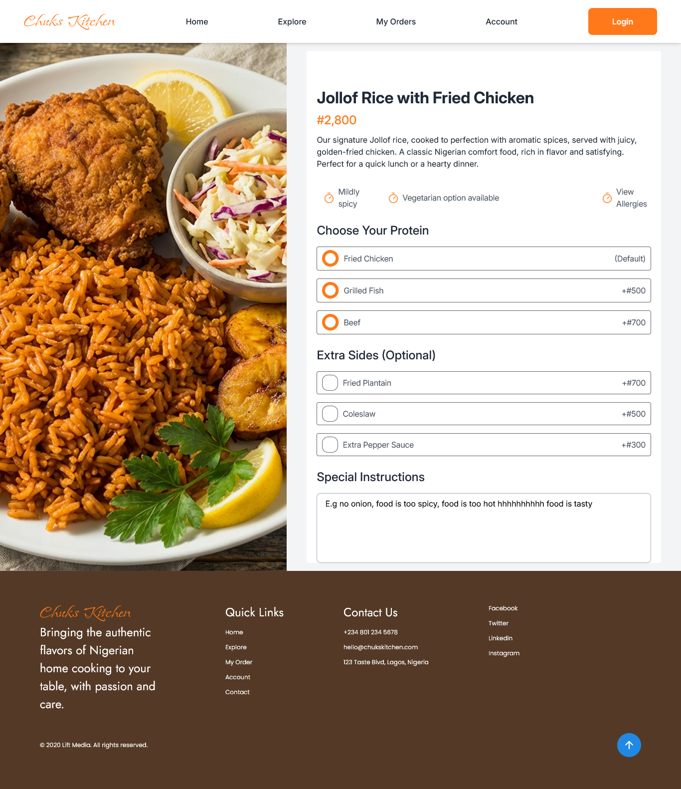

# Project Overview

Chuks Kitchen is a web-based food ordering application designed to showcase Nigerian home-style meals and allow users to browse food items, view details, and interact with the platform through a modern user interface.

## Technologies Used

- React.js – For building reusable UI components

- Tailwind CSS – For styling and responsive design

- Node.js – Runtime environment (for development server)

- npm – For managing project dependencies

### Links

- Solution URL: https://github.com/Bolazcoding/Chuks-Kitchen
- Live Site URL: https://mobolaji-chuks-kitchen.vercel.app/

## Steps to Run the Project Locally

1. Clone the Repository
   Open your terminal and run:
   git clone https://github.com/Bolazcoding/Chuks-Kitchen.git

2. Navigate into the Project Folder
   cd Chuks-Kitchen

3. Install Dependencies
   npm install

This will install all required packages listed in the package.json file.

4. Start the Development Server
   npm run dev

5. Open in Browser

After running the command, the application will start on:
http://localhost:3000

Open this link in your browser to view the application.

## Project Structure Overview

- /app or /pages – Contains the main application pages and routing structure

- /components – Reusable UI components (Navbar, Hero section, Food cards, etc.)

- /public – Static assets such as images

- /styles – Global styling configuration

- package.json – Lists dependencies and scripts

## Build for Production

- To create an optimized production build, run:
  npm run build

- To start the production server:
  npm start

### Screenshot

## Homepage

## Menu Page

## Food Details Page

## Author

Developed by Mobolaji Adelabu (Bolazcoding)
